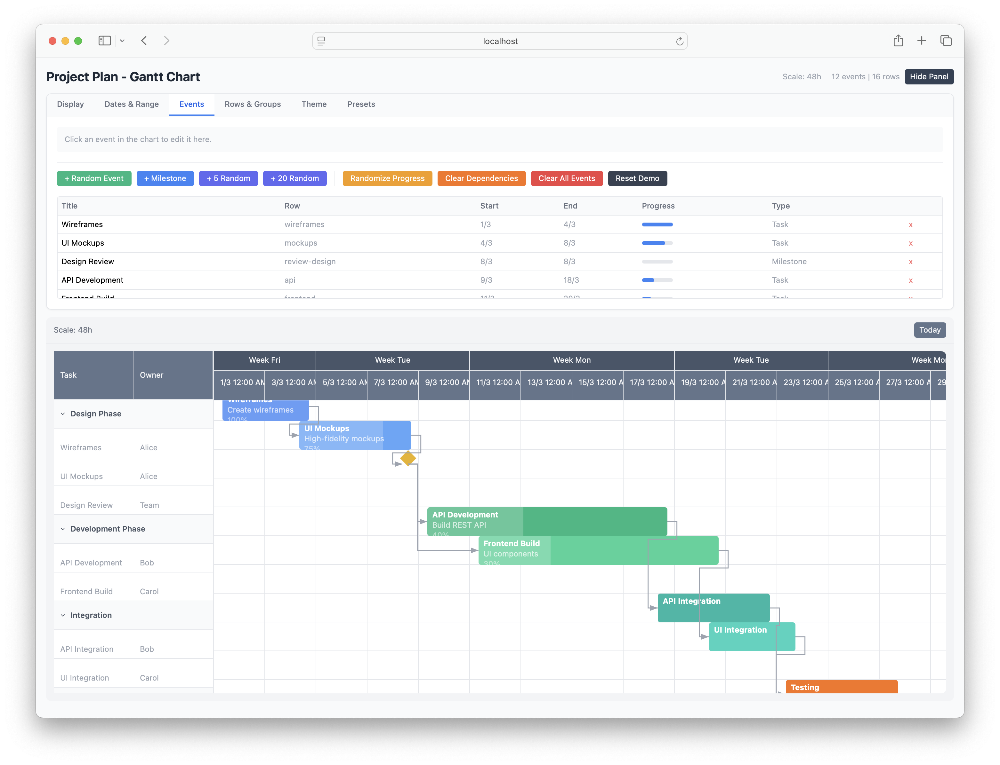

<br/>
<p align="center">
  <a href="https://github.com/tony-nz/vue3-scheduler">
    
  </a>

  <h3 align="center">Vue3 Scheduler</h3>

  <p align="center">
    Essential Timelines Made Easy: Vue Timeline Scheduler for Your Basic Needs.
    <br/>
    <br/>
    <a href="https://github.com/tony-nz/vue3-scheduler"><strong>Explore the docs »</strong></a>
    <br/>
    <br/>
    <a href="https://vue3-scheduler.netlify.app/" _target="blank">View Demo</a>
    .
    <a href="https://github.com/tony-nz/vue3-scheduler/issues">Report Bug</a>
    .
    <a href="https://github.com/tony-nz/vue3-scheduler/issues">Request Feature</a>
  </p>
</p>

## Table Of Contents

- [About the Project](#about-the-project)
  - [Features](#features)
- [Getting Started](#getting-started)
- [Usage](#usage)
- [License](#license)

## About The Project



Vue3 Scheduler simplifies time management in your Vue.js projects. No elaborate features or unnecessary complexity – just a straightforward tool for handling events and timelines.

#### Features

- Display events on a timeline with adjustable scales.
- Customizable styling for events and the timeline.
- Responsive design for various screen sizes.
- Easily integrate with Vue.js applications.

## Getting Started

This is an example of how to list things you need to use the software and how to install them.

```sh
npm install npm@latest -g
```

```sh
npm run dev
```

###

## Usage

```js
<VueScheduler
  :data="timelineData"
  :headers="timelineHeaders"
  :items="timelineItems"
  :options="timelineOptions"
>
  <template #event="{ event, properties }">
    <div
      :class="[
          event.background,
          event.text,
          'p-2',
          'rounded-lg',
          'shadow-md',
          'text-xs',
          'text-left',
          'text-xs',
          'rounded-md',
          'text-nowrap',
          'overflow-auto',
          'opacity-80',
          'truncate',
        ]"
      :style="{ width: properties.width + 'px' }"
    >
      <div class="flex flex-col truncate">
        <div class="font-bold">{{ event.meta?.title }}</div>
        <div class="text-slate-200">{{ event.meta?.description }}</div>
      </div>
    </div>
  </template>
</VueScheduler>
```

```js
  /**
   * Timeline data
   */
  const timelineData = ref<TimelineItem[]>([
    {
      row: 0,
      background: "bg-emerald-500",
      text: "text-white",
      start: "17/02/2024 01:00",
      end: "17/02/2024 02:00",
      meta: { title: "Event 1", description: "Event 1 description" },
    },
    {
      row: 1,
      background: "bg-orange-500",
      text: "text-white",
      start: "17/02/2024 01:00",
      end: "17/02/2024 02:15",
      meta: { title: "Event 2", description: "Event 2 description" },
    },
    {
      row: 1,
      background: "bg-purple-500",
      text: "text-white",
      start: "17/02/2024 02:00",
      end: "17/02/2024 03:15",
      meta: { title: "Event 3", description: "Event 3 description" },
    },
    {
      row: 3,
      background: "bg-orange-500",
      text: "text-white",
      start: "17/02/2024 02:24",
      end: "17/02/2024 03:27",
      meta: { title: "Event 4", description: "Event 4 description" },
    },
    {
      row: 4,
      background: "bg-orange-500",
      text: "text-white",
      start: "18/02/2024 02:24",
      end: "18/02/2024 03:27",
      meta: { title: "Event 5", description: "Event 5 description" },
    },
    {
      row: 5,
      background: "bg-orange-500",
      text: "text-white",
      start: "18/02/2024 02:24",
      end: "19/02/2024 03:27",
      meta: { title: "Event 6", description: "Event 6 description" },
    },
  ]);

  /**
   * Timeline headers
   */
  const timelineHeaders = ref(["Route", "Start time"]);

  /**
   * Generate row data
   */
  const timelineItems = [
    ["BMON-A", "08:00am"],
    ["BMON-B", "08:00am"],
    ["BMON-C", "08:00am"],
    ["BMON-D", "08:00am"],
    ["BMON-E", "08:00am"],
    ["BMON-F", "08:00am"],
    ["BMON-G", "08:00am"],
  ];

  /**
   * Timeline options
   */
  const timelineOptions = ref<TimelineOptions>({
    cellWidth: 50,
    row: {
      height: 80,
      marginTop: 4,
    },
    scale: 0.5,
    start: "17/02/2024 00:00",
    end: "19/02/2024 23:59",
  });
```

## License

Distributed under the MIT License. See [LICENSE](https://github.com/tony-nz/vue3-scheduler/blob/main/LICENSE.md) for more information.
