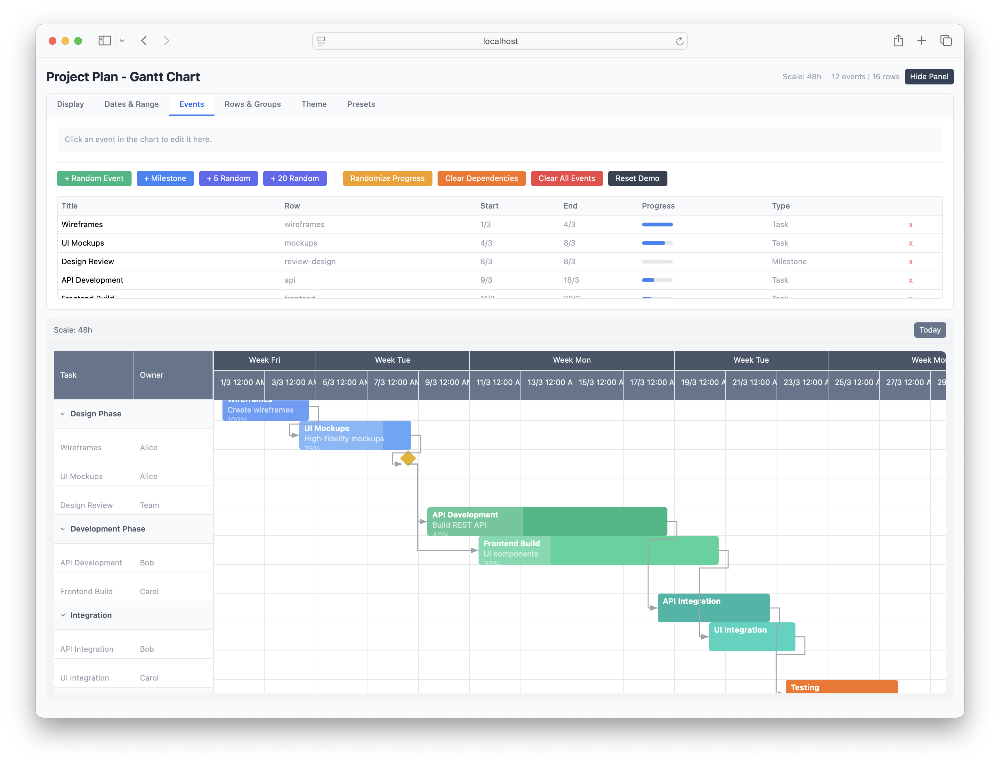

<p align="center">
  <h1 align="center">Vue3 Gantt Chart</h1>
  <p align="center">
    A fully interactive Gantt chart component for Vue 3. Drag events, draw dependency arrows, collapse groups, zoom timelines, and theme everything — out of the box.
  </p>
  <p align="center">
    <a href="https://vue3-scheduler.netlify.app/"><strong>Live Demo</strong></a>
    &nbsp;&middot;&nbsp;
    <a href="https://github.com/tony-nz/vue3-scheduler/issues">Report Bug</a>
    &nbsp;&middot;&nbsp;
    <a href="https://github.com/tony-nz/vue3-scheduler/issues">Request Feature</a>
  </p>
</p>

<br/>



---

## Why This Exists

Most Gantt chart libraries are either heavyweight enterprise widgets or thin wrappers that break the moment you need real interactivity. This one gives you drag-and-drop, dependency arrows, collapsible groups, progress tracking, milestones, keyboard navigation, and full theming — all in a ~2,800-line Vue 3 codebase with zero runtime dependencies beyond Vue and InteractJS.

---

## Quick Start

```sh
git clone https://github.com/tony-nz/vue3-scheduler.git
cd vue3-scheduler
npm install
npm run dev
```

Open `localhost:5173`. The demo app includes an interactive options panel where you can tweak every setting, swap themes, load different dataset presets, add/remove events, and edit everything live.

---

## Minimal Example

```vue
<template>
  <div style="height: 500px">
    <GanttChart
      :start="start"
      :end="end"
      :events="events"
      :rows="rows"
      :headers="['Task', 'Owner']"
      :options="{ scale: 24, cellWidth: 80, rowHeight: 45 }"
      @event-drag-end="onDrag"
      @cell-click="onCreate"
    >
      <template #event="{ event }">
        <div class="px-2 py-1 text-xs text-white">
          <b>{{ event.meta?.title }}</b>
        </div>
      </template>
    </GanttChart>
  </div>
</template>

<script setup lang="ts">
import { ref, reactive } from "vue";
import type { GanttEvent, GanttGroup } from "./types/gantt";
import GanttChart from "./components/GanttChart.vue";

const start = new Date(2024, 2, 1);
const end = new Date(2024, 3, 1);

const rows = reactive<GanttGroup[]>([
  {
    id: "dev",
    label: "Development",
    children: [
      { id: "design", columns: ["Design", "Alice"] },
      { id: "build", columns: ["Build", "Bob"] },
    ],
  },
]);

const events = ref<GanttEvent[]>([
  {
    id: "e1",
    rowId: "design",
    start: new Date(2024, 2, 1),
    end: new Date(2024, 2, 8),
    progress: 80,
    meta: { title: "Design", class: "bg-blue-500 rounded" },
  },
  {
    id: "e2",
    rowId: "build",
    start: new Date(2024, 2, 8),
    end: new Date(2024, 2, 22),
    progress: 20,
    dependencies: ["e1"],
    meta: { title: "Build", class: "bg-emerald-500 rounded" },
  },
]);

function onDrag(payload) {
  const i = events.value.findIndex((e) => e.id === payload.event.id);
  if (i !== -1) events.value[i] = { ...events.value[i], ...payload.event };
}

function onCreate(payload) {
  events.value.push({
    id: `evt-${Date.now()}`,
    rowId: payload.rowId,
    start: payload.date,
    end: new Date(payload.date.getTime() + 86400000),
    meta: { title: "New Task", class: "bg-gray-500 rounded" },
  });
}
</script>
```

---

## Features

### Interactions
| Feature | How it works |
|---------|-------------|
| **Drag & drop** | Grab any event bar and move it — snaps to grid, constrained to parent |
| **Resize** | Drag left or right edge to change start/end dates |
| **Click to create** | Click any empty cell to emit `cell-click` with row + date |
| **Keyboard** | Arrow keys scroll/select, Delete removes, Escape deselects |
| **Wheel zoom** | Mouse wheel zooms the time scale in/out |
| **Selection** | Click to select, shows ring highlight, exposes `selectedEventId` |

### Visual
| Feature | How it works |
|---------|-------------|
| **Dependency arrows** | Set `dependencies: ["other-event-id"]` — SVG arrows are drawn automatically |
| **Progress bars** | Set `progress: 0-100` — shows a fill overlay inside the event bar |
| **Milestones** | Set `isMilestone: true` — renders as a diamond marker instead of a bar |
| **Multi-level headers** | Configure `timelineLevels: [{ unit: "weeks" }]` — merged header row above the main timeline |
| **Current time line** | Red vertical line at "now", updates every 60s |
| **Hover line** | Green line follows the cursor across the grid |
| **Collapsible groups** | Click chevrons in the sidebar to collapse/expand, supports deep nesting |

### Customization
| Feature | How it works |
|---------|-------------|
| **Slot-based events** | `#event` slot gives you full control over event bar content |
| **Toolbar slot** | `#toolbar` slot to replace the default scale display |
| **CSS variable theming** | 10 CSS variables control all structural colors — override at any level |
| **Reactive options** | Change `cellWidth`, `rowHeight`, `scale`, etc. at runtime — everything updates live |

---

## API Reference

### Props

| Prop | Type | Required | Default | Description |
|------|------|----------|---------|-------------|
| `start` | `Date` | Yes | — | Timeline start |
| `end` | `Date` | Yes | — | Timeline end |
| `events` | `GanttEvent[]` | Yes | — | Events to render |
| `rows` | `(GanttRow \| GanttGroup)[]` | No | `[]` | Sidebar row/group hierarchy |
| `headers` | `string[]` | Yes | — | Sidebar column headers |
| `options` | `GanttOptions` | No | See below | Display & behavior config |

### Options

| Option | Type | Default | Description |
|--------|------|---------|-------------|
| `cellWidth` | `number` | `100` | Width of each timeline cell in px |
| `rowHeight` | `number` | `50` | Height of each row in px |
| `scale` | `number` | `0.5` | Hours per cell (24 = one cell per day) |
| `scaleUnit` | `ScaleUnit` | — | Preset: `"minutes"` `"hours"` `"days"` `"weeks"` `"months"` |
| `timelineLevels` | `GanttTimelineLevel[]` | `[]` | Multi-level header config |
| `scrollSpeed` | `number` | `5` | Wheel events required before zoom triggers |
| `showCurrentTime` | `boolean` | `true` | Show red "now" line |
| `showHoverLine` | `boolean` | `true` | Show green cursor-following line |

### Emitted Events

| Event | Payload | When |
|-------|---------|------|
| `event-click` | `{ event, nativeEvent }` | Event bar clicked |
| `event-drag-end` | `{ event, oldStart, oldEnd, oldRowId }` | Drag completed — `event` contains new dates/row |
| `event-resize-end` | `{ event, edge, oldStart, oldEnd }` | Resize completed — `edge` is `"left"` or `"right"` |
| `cell-click` | `{ rowId, date, nativeEvent }` | Empty grid cell clicked |
| `group-toggle` | `groupId, collapsed` | Sidebar group expanded/collapsed |
| `scale-change` | `scale` | Zoom level changed via wheel |
| `event-select` | `eventId \| null` | Selection changed |
| `event-delete` | `GanttEvent` | Delete/Backspace pressed on selected event |

### Exposed Methods

Access via template ref (`ref="ganttRef"`):

| Method/Property | Description |
|----------------|-------------|
| `scale` | Current zoom scale (reactive) |
| `selectedEventId` | Currently selected event ID (reactive, read/write) |
| `scrollToNow()` | Scrolls the timeline to center on current time |
| `createEventAt(rowId, date, durationHours?)` | Returns a new `GanttEvent` object with a generated ID |

---

## Data Structures

```typescript
// An event on the timeline
interface GanttEvent {
  id: string;                // Unique identifier
  rowId: string;             // Which row to display on
  start: Date;               // Start datetime
  end: Date;                 // End datetime
  progress?: number;         // 0-100, shown as fill bar
  isMilestone?: boolean;     // Diamond marker instead of bar
  dependencies?: string[];   // IDs of prerequisite events (draws arrows)
  meta?: {
    class?: string;          // Tailwind classes (e.g. "bg-blue-500 rounded")
    title?: string;
    description?: string;
    [key: string]: unknown;  // Your own custom fields
  };
}

// A row in the sidebar
interface GanttRow {
  id: string;                // Must match event.rowId
  columns: string[];         // Values for each header column
}

// A collapsible group containing rows or nested groups
interface GanttGroup {
  id: string;
  label: string;             // Displayed in sidebar
  collapsed?: boolean;
  children?: (GanttRow | GanttGroup)[];
}
```

---

## Theming

Every structural color is a CSS variable with a sensible fallback. Override them on any parent element:

```css
.dark-gantt {
  --gantt-bg: #1e293b;
  --gantt-header-bg: #334155;
  --gantt-header-bg-alt: #1e293b;
  --gantt-header-text: #e2e8f0;
  --gantt-sidebar-bg: #334155;
  --gantt-group-bg: #1e293b;
  --gantt-group-text: #94a3b8;
  --gantt-text-muted: #64748b;
  --gantt-cell-bg: #0f172a;
  --gantt-grid-border: #334155;
}
```

The demo includes 6 built-in themes (Default, Dark, Midnight, Ocean, Sunset, Nord) and a live color picker that generates CSS you can copy.

---

## Architecture

```
src/
  types/
    gantt.ts                    # All interfaces, type guards, flattenGroups helper
  composables/
    useTimeline.ts              # Timeline slot generation, dateToPixel/pixelToDate math,
                                # multi-level headers, wheel zoom
    useInteract.ts              # InteractJS drag & resize setup with cleanup
    useScrollSync.ts            # Bidirectional scroll sync between two elements
  components/
    GanttChart.vue              # Root — layout, props, emits, keyboard, scroll sync
    GanttSidebar.vue            # Headers + collapsible row tree with indent
    GanttTimeline.vue           # Multi-level header + bottom time slots
    GanttGrid.vue               # Background cells, event bars, milestones, arrows
    GanttEventBar.vue           # Single event — progress fill, resize handles, slot
    GanttDependencyLines.vue    # SVG overlay drawing connector arrows
    GanttCurrentTimeLine.vue    # Red vertical "now" indicator
    GanttHoverLine.vue          # Green cursor-following line
```

Key design decisions:
- **InteractJS for gestures only** — applies CSS `transform` during drag for visual feedback, then resets and emits new dates on `dragend` so Vue re-renders correctly
- **SVG overlay for arrows** — single `<svg>` with `pointer-events: none` draws all dependency paths without blocking event interactions
- **Composables over mixins** — all logic is extracted into testable, reusable functions
- **String IDs everywhere** — events reference rows by `rowId`, dependencies by event `id` — decoupled from array indices

---

## Tech Stack

| | |
|-|-|
| **Framework** | Vue 3 with `<script setup lang="ts">` |
| **Language** | TypeScript (strict mode) |
| **Styling** | Tailwind CSS 3 |
| **Interactions** | InteractJS |
| **Build** | Vite 4 |
| **Linting** | ESLint + Prettier |

---

## License

MIT. See [LICENSE](https://github.com/tony-nz/vue3-scheduler/blob/main/LICENSE.md).
